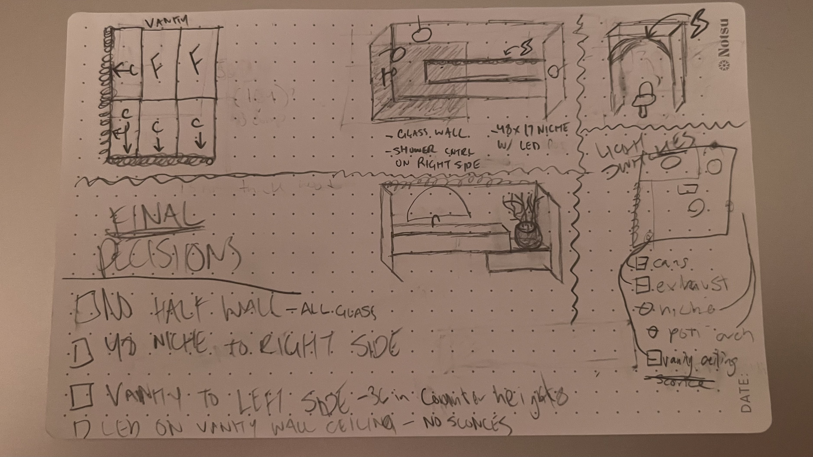

# BATHROOM RENOVATION — UPDATED SCOPE
### Changes after demo. Read before continuing work.

*Reference sketch / Croquis de referencia.* Top left = vanity wall tile layout: **F = full tile, C = cut tile.** Full tiles top and right, cuts on the left edge and bottom row.

---
---

# PART 1 — BY AREA

## 1. SHOWER

- **NO half wall.** Full glass enclosure instead.
- Shower **controls → RIGHT short wall**
- Showerheads + body sprays → **LEFT short wall** (opposite controls)
- **Rainfall head mounted to the CEILING**
- **Niche: 48" wide × 17" high**, on the right side, with **LED inside**
- Shower walls: white subway 8.5" × 2.5" — **stacked straight vertical, NO stagger**
- Shower floor: fluted tile, run **long-ways as seen from the entrance**, flutes pointing toward drain
- **Niche grout lines must line up with subway grout lines.** Dry-lay first.

## 2. VANITY WALL

- Vanity is **48"L × 18"D × 20"H — FLOATING (wall-hung)**
- **Countertop at 36" off the floor**
- Vanity pushed **ALL THE WAY LEFT**
- ~18" open space on the right stays **empty** (towel hook / plant stool)
- **NO SCONCES** — cancelled
- **Hidden LED channel along the TOP EDGE of the wall**, from left edge to where shower glass starts
- Mirror **centered on the vanity**, not on the wall
- **3 switches** in existing box to the **LEFT of the vanity**: vanity LED / can lights / exhaust fan
- Tile: 2×4 marble-look — **stacked straight vertical, NO stagger**
- **Start with a FULL tile at TOP RIGHT.** Work left and down. All cuts land on the **left edge and bottom row only.**

## 3. TOILET AREA

- Nook is ~32" wide × 40" deep
- **Frame + drywall an ARCH** at the front of the nook — toilet sits partly under it
- **Arch depth ~4"–5"** (final number TBD) — deep enough for a **shelf**
- Toilet floor rough-in is done — ready to set
- **Bidet needs BOTH: GFCI outlet + water tap-off**
- **CHANGE: cancel the single accent bulb.** Instead → **hidden LED channel outlining the whole arch**
- **2 switches** in existing box on the wall **left of the toilet, right of the additional door**: arch LED / niche LED

---
---

# PART 2 — BY TRADE

## FRAMING / DRYWALL

- [ ] **DO NOT build the half wall.** Cancelled — all glass.
- [ ] Frame shower niche, right side: **48" × 17" finished opening.** Confirm with tile setter before closing up.
- [ ] Blocking for glass panel
- [ ] **Blocking for floating vanity** — 48" wide, top at 36"
- [ ] Frame + drywall the **arch** at toilet nook, 4"–5" deep, with shelf ledge
- [ ] Leave recesses for **3 plaster-in LED channels**: niche, vanity wall top edge, arch outline

## PLUMBING

- [ ] Shower **controls → RIGHT short wall**
- [ ] Showerheads + sprays → **LEFT short wall**
- [ ] **Rainfall head drop in the CEILING**
- [ ] Slope shower floor to drain — flutes run toward drain
- [ ] **Verify vanity stub-outs** land behind the 48" cabinet, centered on basin, high enough for a floating vanity — **do this now, walls are open**
- [ ] **Water tap-off for the bidet** at the toilet

## ELECTRICAL

- [ ] **Cancel sconce boxes** on vanity wall
- [ ] **Cancel single accent bulb** in toilet arch
- [ ] **3-gang at vanity (existing box):** 1) vanity LED  2) can lights  3) exhaust fan
- [ ] **2-gang by the additional door (existing box):** 1) arch LED  2) niche LED
- [ ] **3 low-voltage LED runs:** niche / vanity wall top edge / arch outline
- [ ] Use **trimless plaster-in channel**; arch needs **flexible channel + flexible strip** to follow the curve
- [ ] **All LEDs are 3000K** — uniform across niche, vanity wall, and arch
- [ ] **Owner is supplying the switches/dimmers**
- [ ] **2-gang by the door = 2 DIMMERS** (arch LED + niche LED). Vanity LED on the 3-gang should also be a dimmer.
- [ ] **Confirm a NEUTRAL is present** in both switch boxes — dimmers require it
- [ ] **Drivers must be ELV / reverse-phase dimmable and matched to the dimmer** — wrong pairing = flicker and buzz

## TILE

- [ ] Shower walls: white subway 8.5×2.5 — **straight vertical stack, no stagger**
- [ ] Shower floor: fluted tile, **long-ways from the entrance**, flutes toward drain
- [ ] Niche: 2×4 marble-look — **back face is one full piece**; tile the return edges too
- [ ] **DRY-LAY FIRST** — confirm niche top/bottom hit the subway grout lines before setting anything
- [ ] Vanity wall: 2×4 marble-look — **full tile at top right**, cuts on left edge + bottom row only
- [ ] Carry grout lines **level across both walls** so they read continuous
- [ ] **Grout colors TBD** — do not set until confirmed

---
---

# ITEMS TO CONSIDER

1. **48" × 17" niche is TILE SIZE ONLY** — grout joints not accounted for. Dry-lay before framing closes.
2. **Niche return edges still need tile.** "One tile" only applies to the flat back face.
3. **Verify vanity stub-out placement while the wall is open.** Cheap now, nightmare after tile.
4. **Grout colors** — pick one per tile type (niche marble, subway, fluted floor, vanity marble) before anyone sets.
5. **Final arch depth needed** — 4", 5", or match the toilet tank. Framer needs a number.
6. **Bidet needs water AND power** — confirm the water tap-off, not just the outlet.
7. **Neutral in both switch boxes.** The 2-gang was wired for a plain bulb — check for a neutral before the walls close, or the dimmers won't work.
8. **Two switch locations now.** Confirm feeds so the arch LED is switched from the toilet-side box, not the old accent-bulb leg.

# NOTES OF BENEFITS

1. 48" niche width = exactly one 2×4 tile run → seamless back face, no vertical seams.
2. Full tile at top-right on vanity wall = clean edge where wall meets shower glass, all cuts hidden in the corner and along the floor.
3. Plumbing already in the wall (not the floor) = floating vanity works with no re-run from slab. Big win.
4. Trimless plaster-in channel = no visible hardware, and it reuses wiring already run.
5. Arch reveal does double duty — accent light *and* shelf storage in one detail.
6. Straight vertical stack on both walls = grout lines can carry level from shower to vanity wall.

---
---
---

# BAÑO — ALCANCE ACTUALIZADO
### Cambios después de la demolición. Leer antes de seguir trabajando.

---
---

# PARTE 1 — POR ÁREA

## 1. REGADERA / DUCHA

- **NO se hace el medio muro.** Todo será **vidrio**.
- **Llaves/controles → pared corta DERECHA**
- Regaderas y rociadores → **pared corta IZQUIERDA** (lado opuesto a las llaves)
- **Regadera tipo lluvia montada en el TECHO**
- **Nicho: 48" de ancho × 17" de alto**, lado derecho, con **LED adentro**
- Paredes: azulejo tipo metro (subway) blanco 8.5" × 2.5" — **alineado vertical en cuadrícula, SIN traslape**
- Piso: loseta acanalada (fluted), **a lo largo visto desde la entrada**, las ranuras apuntando a la coladera
- **Las juntas del nicho deben alinearse con las juntas del subway.** Hacer prueba en seco primero.

## 2. PARED DEL LAVABO (VANITY)

- Mueble: **48" largo × 18" fondo × 20" alto — FLOTANTE (colgado a la pared)**
- **Cubierta a 36" del piso**
- Mueble pegado **TODO A LA IZQUIERDA**
- ~18" de espacio a la derecha se queda **vacío** (gancho de toalla / banco con planta)
- **SIN LÁMPARAS DE PARED (sconces)** — cancelado
- **Canal LED oculto en el BORDE SUPERIOR de la pared**, del extremo izquierdo hasta donde empieza el vidrio
- Espejo **centrado con el mueble**, no con la pared
- **3 apagadores** en la caja existente a la **IZQUIERDA del mueble**: LED del mueble / luces empotradas / extractor
- Azulejo: 2×4 tipo mármol — **alineado vertical, SIN traslape**
- **Empezar con una loseta COMPLETA ARRIBA A LA DERECHA.** Seguir hacia la izquierda y hacia abajo. Los cortes solo van en el **borde izquierdo y la fila de abajo.**

## 3. ÁREA DEL INODORO

- Espacio de ~32" de ancho × 40" de fondo
- **Enmarcar y hacer un ARCO en drywall** al frente del espacio — el inodoro queda parcialmente debajo
- **Profundidad del arco ~4"–5"** (número final pendiente) — suficiente para una **repisa**
- La salida de drenaje en el piso ya está lista
- **El bidé necesita LAS DOS COSAS: contacto GFCI + toma de agua**
- **CAMBIO: se cancela el foco de acento.** En su lugar → **canal LED oculto que rodea todo el arco**
- **2 apagadores** en la caja existente en la pared **a la izquierda del inodoro, a la derecha de la puerta adicional**: LED del arco / LED del nicho

---
---

# PARTE 2 — POR OFICIO

## ESTRUCTURA / DRYWALL

- [ ] **NO construir el medio muro.** Cancelado — todo vidrio.
- [ ] Enmarcar el nicho, lado derecho: **abertura terminada de 48" × 17".** Confirmar con el azulejero antes de cerrar.
- [ ] Refuerzo (blocking) para el panel de vidrio
- [ ] **Refuerzo para el mueble flotante** — 48" de ancho, cubierta a 36"
- [ ] Enmarcar y terminar el **arco** del inodoro, 4"–5" de fondo, con repisa
- [ ] Dejar espacio para **3 canales LED empotrados**: nicho, borde superior de la pared del lavabo, contorno del arco

## PLOMERÍA

- [ ] **Llaves → pared corta DERECHA**
- [ ] Regaderas y rociadores → **pared corta IZQUIERDA**
- [ ] **Bajada de regadera tipo lluvia en el TECHO**
- [ ] Dar caída al piso hacia la coladera — las ranuras corren hacia el desagüe
- [ ] **Verificar las salidas de agua y drenaje del lavabo**: deben quedar detrás del mueble de 48", centradas con el lavabo y a la altura correcta para mueble flotante — **hacerlo AHORA que la pared está abierta**
- [ ] **Toma de agua para el bidé** en el inodoro

## ELECTRICIDAD

- [ ] **Cancelar las cajas de las lámparas de pared (sconces)**
- [ ] **Cancelar el foco de acento** del arco
- [ ] **Caja de 3 apagadores junto al lavabo (ya existe):** 1) LED del lavabo  2) luces empotradas  3) extractor
- [ ] **Caja de 2 apagadores junto a la puerta adicional (ya existe):** 1) LED del arco  2) LED del nicho
- [ ] **3 corridas LED de bajo voltaje:** nicho / borde superior pared del lavabo / contorno del arco
- [ ] Usar **canal empotrado sin marco (se resana al drywall)**; el arco necesita **canal y tira flexible** para seguir la curva
- [ ] **Todos los LED son de 3000K** — igual en nicho, pared del lavabo y arco
- [ ] **El dueño compra los apagadores/dimmers**
- [ ] **Caja de 2 junto a la puerta = 2 DIMMERS** (LED del arco + LED del nicho). El LED del lavabo en la caja de 3 también lleva dimmer.
- [ ] **Confirmar que haya NEUTRO** en las dos cajas — los dimmers lo necesitan
- [ ] **Las fuentes (drivers) deben ser ELV / fase inversa regulables y compatibles con el dimmer** — si no coinciden, parpadea y zumba

## AZULEJO

- [ ] Paredes de regadera: subway blanco 8.5×2.5 — **alineado vertical, sin traslape**
- [ ] Piso de regadera: loseta acanalada, **a lo largo desde la entrada**, ranuras hacia la coladera
- [ ] Nicho: 2×4 tipo mármol — **el fondo es UNA sola pieza**; también azulejar los cantos/retornos
- [ ] **PRUEBA EN SECO PRIMERO** — confirmar que arriba y abajo del nicho caen en las juntas del subway antes de pegar nada
- [ ] Pared del lavabo: 2×4 tipo mármol — **loseta completa arriba a la derecha**, cortes solo a la izquierda y abajo
- [ ] Mantener las juntas **niveladas entre las dos paredes** para que se vean continuas
- [ ] **Color de la lechada pendiente** — no pegar hasta confirmar

---
---

# PUNTOS A CONSIDERAR

1. **48" × 17" del nicho es MEDIDA DE LOSETA SOLAMENTE** — no incluye las juntas. Prueba en seco antes de cerrar el enmarcado.
2. **Los cantos del nicho también llevan azulejo.** "Una sola loseta" aplica solo al fondo plano.
3. **Verificar la posición de las salidas del lavabo con la pared abierta.** Barato ahora, carísimo después del azulejo.
4. **Color de lechada** — elegir uno por cada tipo de loseta antes de que alguien empiece a pegar.
5. **Falta la profundidad final del arco** — 4", 5", o igual al tanque del inodoro. El carpintero necesita el número.
6. **El bidé necesita agua Y electricidad** — confirmar la toma de agua, no solo el contacto.
7. **Neutro en las dos cajas de apagadores.** La caja de 2 se cableó para un foco simple — revisar que haya neutro antes de cerrar las paredes, o los dimmers no funcionarán.
8. **Ahora son dos ubicaciones de apagadores.** Confirmar la alimentación para que el LED del arco se controle desde la caja del lado del inodoro.

# BENEFICIOS

1. Nicho de 48" = exactamente una corrida de loseta 2×4 → fondo sin costuras verticales.
2. Loseta completa arriba a la derecha = borde limpio donde la pared encuentra el vidrio, y todos los cortes escondidos.
3. La plomería ya está en la pared (no en el piso) = el mueble flotante funciona sin rehacer el drenaje. Gran ventaja.
4. Canal empotrado sin marco = sin herrajes visibles, y aprovecha cableado ya instalado.
5. El arco sirve doble: luz de acento **y** repisa en un solo detalle.
6. Alineación vertical en ambas paredes = las juntas pueden correr niveladas de la regadera a la pared del lavabo.
